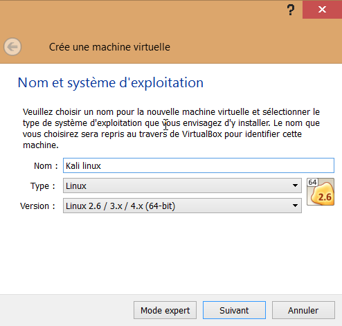
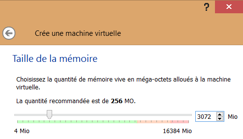

## Recommandations pour le CTF

Le CTF de la Secu'RT proposant bon nombre de challenges, il vous est recommandé de préparer votre machine comme il se doit. 
Pour ce faire, et selon votre niveau, nous vous invitons à suivre ces quelques recommandations.

Débutant installation USB
-------------------------

*Permet de démarrer son ordinateur sous un système d'exploitation différent.*

De loin la version la plus **simple à réaliser**, qui ne nécessite **aucune modification** de votre système d'exploitation : [Créer une clef USB Kali Linux](http://fr.docs.kali.org/installation-fr/kali-linux-sur-usb)

La partie **Persistance à votre clef USB** est recommandé, mais pas indispensable.

Débutant installation machine virtuelle
---------------------------------------

*Permet de ne pas avoir à changer son système et d'utiliser un autre système en parallèle.*

* Télécharger et installer [VirtualBox](https://www.virtualbox.org/wiki/Downloads)
* Lancer **VirtualBox** et créer une **nouvelle** machine virtuelle
* Ensuite boite de dialogue s'ouvre alors, il faut la remplir comme ceci

	
* Il faut ensuite préciser la quantité de RAM, le **minimum recommandé étant de 2048 Mo**

	

* Créer un nouveau disque dur virtuel
	* Format VDI
	* Dynamiquement alloué
	* De 20 Go