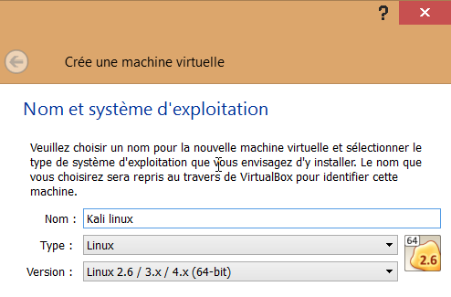
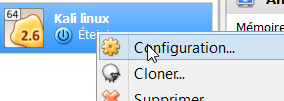
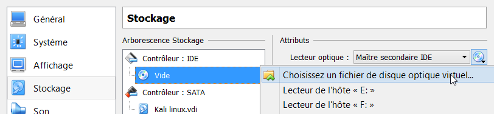
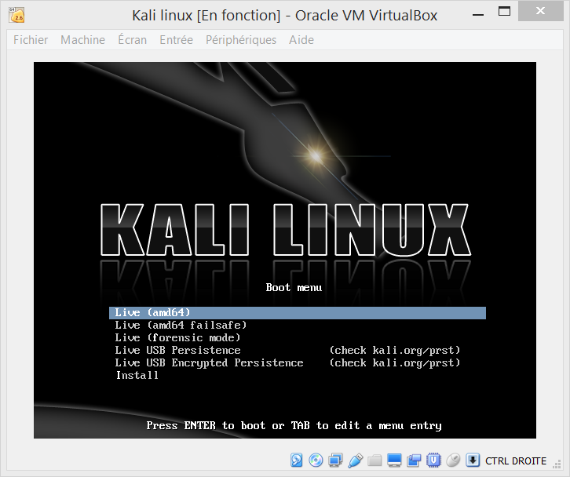

Recommandations pour le CTF
===========================

Le CTF de la Secu'RT proposant bon nombre de challenges, il vous est recommandé de préparer votre machine comme il se doit. 
Pour ce faire, et selon votre niveau, nous vous invitons à suivre ces quelques recommandations.

Novice live USB
---------------

*Permet de démarrer son ordinateur, depuis une client USB, sous un système d'exploitation différent.*

De loin la version la plus **simple à réaliser**, qui ne nécessite **aucune modification** de votre système d'exploitation : [Créer une clef USB Kali Linux](http://fr.docs.kali.org/installation-fr/kali-linux-sur-usb)

La partie **Persistance à votre clef USB** est recommandé, mais pas indispensable.

Novice installation machine virtuelle
-------------------------------------

*Permet de ne pas avoir à changer son système et d'utiliser un autre système en parallèle.*

* Télécharger et installer [VirtualBox](https://www.virtualbox.org/wiki/Downloads)
* Lancer **VirtualBox** et créer une **nouvelle** machine virtuelle
* Ensuite boite de dialogue s'ouvre alors, il faut la remplir comme ceci

	
* Il faut ensuite préciser la quantité de RAM, le **minimum recommandé étant de 2048 Mo**

	

* Créer un nouveau disque dur virtuel
	* Format VDI
	* Dynamiquement alloué
	* De 20 Go minimum

* Clique droit, configuration

	

* Réseau
	* Mode d'accès réseau : **Accès par pont**
	* Nom : **Nom de la carte réseau souhaitée**

* Télécharger [l'image DVD de Kali Linux](https://www.kali.org/downloads/)
* Stockage

	
	* Choisissez le .iso téléchargé précédemment

* Vous pouvez maintenant démarrer la Machine Virtuelle et procéder à une installation classique ou profiter du LiveCD

	

Expérimenté
-----------

Préparer votre machine pour : 

* Du **reverse engineering**
* Des applications **web vulnérables** (XSS, SQLi, CSRF ...)
* Reverse de **codes obfusqué**
* Sécurité des réseaux